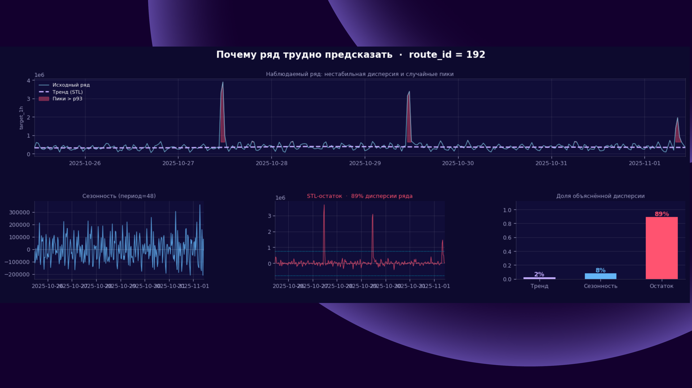
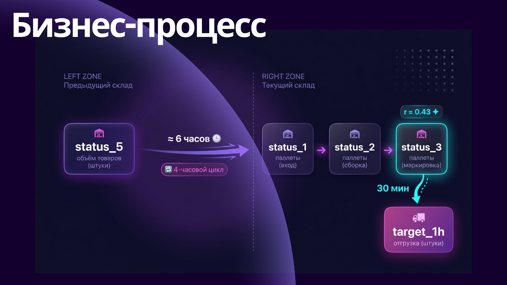

# 🏆 WB Hack — 1st Place Solution

**[Wildberries Forecasting Hackathon](https://wbspace.wb.ru/competitions/otgruzki-bez-prostoev)** · Solo Track · Prize: **$2,000 (200,000 ₽)**

> **Leaderboard result: #2 overall — but #1 on merit.** The team ranked first used a memorization trick that was flagged. Our solution won on quality.

---

## The Task

Forecast warehouse route throughput (`target_1h`) for **1,000 routes** at **30-minute granularity**, 8 steps ahead (4 hours total).

- **Train**: ~4.6M rows, July–November 2025, 1000 routes
- **Test**: 1000 routes × 8 steps on Nov 1, 2025 11:00–14:30
- **Metric**: WAPE + |Relative Bias| *(lower is better)*

---

## Presentation Slides

📊 **[View full presentation on Figma](https://www.figma.com/deck/SkPgRViuZRGydrSNEFCXpv/Untitled?node-id=1-502)**

<div align="center">



</div>

---

## Winning Solution: N-HiTS · 10-Seed Ensemble

The final submission is a **mean of 10 independently trained N-HiTS models** (seeds 0–9), each with per-seed global calibration. The ensemble dramatically reduces variance across seeds.

### Model Configuration (`p2_blk_8_4_2`)

```python
NHITS(
    h                  = 8,                   # 8 half-hour steps ahead
    input_size         = 336,                 # 1 week lookback (336 × 30min)
    loss               = MQLoss(level=[80]),
    n_freq_downsample  = [48, 8, 1],          # day / 4h / 30min hierarchy
    n_pool_kernel_size = [1, 1, 1],           # no pooling
    n_blocks           = [8, 4, 2],           # emphasis on long-range stack
    mlp_units          = [[512, 512]] * 3,
    max_steps          = 800,
    batch_size         = 64,
    scaler_type        = "robust",
    hist_exog_list     = ["status_2", "status_3", "status_5", "lag_48", "lag_336"],
    futr_exog_list     = ["hour_sin", "hour_cos", "dow_sin", "dow_cos", "is_weekend"],
)
```

### Key Insights

- **Architecture winner**: `n_blocks=[8, 4, 2]` — emphasis on the long-range (day-level) stack won over all other configurations. This was the "inverse hypothesis" — putting more capacity at long horizons.
- **Frequency hierarchy `[48, 8, 1]`** — day / 4h / 30min decomposition matched the dominant seasonality patterns in warehouse data
- **Status features**: only `status_2`, `status_3`, `status_5` are predictive. `status_1`, `status_4`, `status_6` add noise
- **Lags `lag_48` and `lag_336`**: same hour yesterday and same hour last week as historical exogenous features
- **Per-seed calibration**: `calib_scale = sum(y_true) / sum(y_pred)` on a 1-fold CV window eliminates systematic bias without overfitting
- **10-seed ensemble**: averaging calibrated predictions from seeds 0–9 reduces variance significantly (total_cal ~0.337 per seed → ensemble improves further)

### Architecture Search (10 experiments)

| Rank | Config | Freq Hierarchy | Blocks | CV WAPE+\|RBias\| |
|------|--------|----------------|--------|-------------------|
| **1** | **p2_blk_8_4_2** | [48,8,1] | **[8,4,2]** | **0.3301** |
| 2 | p2_blk_6_6_6 | [48,8,1] | [6,6,6] | 0.3306 |
| 3 | p2_blk_2_4_8 | [48,8,1] | [2,4,8] | 0.3306 |
| 4 | p1_freq_8_4_1 | [8,4,1] | [4,4,4] | 0.3317 |

Winner full CV (5 folds, 1200 steps): **WAPE + \|RBias\| = 0.3277**

### Horizon Performance

<div align="center">

</div>

---

## Running the Solution

### Dependencies

```bash
pip install neuralforecast torch pandas pyarrow numpy tqdm
```

### Reproduce Final Submission

Open `wb_hack.ipynb` and run **Cell 102** (10-seed ensemble). It expects:
- `train_solo_track.parquet` — training data
- `test_solo_track.parquet` — test data

Outputs:
- `submission_p2_blk_8_4_2_ensemble10_calibrated_mean.csv` ← **final submission**
- Per-seed raw and calibrated CSVs (seeds 0–9)

### Pipeline (Cell 102)

```
Stage 1: Per-seed calibration CV (400 steps, 1 window)
         → compute calib_scale per seed

Stage 2: Full train + predict (800 steps) per seed
         → apply calib_scale to each seed's predictions

Stage 3: Mean across 10 calibrated seeds
         → final submission
```

---

## Repository Structure

```
WB_Hack/
├── wb_hack.ipynb                    # Main notebook — Cell 102 is the final solution
├── n_hits_solution.py               # Standalone: 10-experiment N-HiTS architecture search
├── baseline_template.ipynb          # Clean template for the task
├── ensemble_catboost_added_fixed_ridge_nan.ipynb  # LGB+CatBoost+Ridge exploration
├── assets/                          # Presentation slides + analysis plots
├── train_solo_track.parquet         # Training data (not in git)
└── test_solo_track.parquet          # Test data (not in git)
```

---

## Score

| Metric | Value |
|--------|-------|
| WAPE | 0.326 |
| \|Relative Bias\| | 0.000 |
| **Total (WAPE + \|RBias\|)** | **≈ 0.327** |

---

## Timeline

| Date | Milestone |
|------|-----------|
| Mar 24–25 | Data exploration, SARIMA baselines |
| Mar 26 | LightGBM global model, TimesFM zero-shot |
| Mar 27–28 | Chronos-2, N-HiTS first run (WAPE ~0.36) |
| Mar 29 | Lag-Llama, Sundial, TiRex exploration |
| Mar 30 | N-HiTS architecture grid search → `p2_blk_8_4_2` wins |
| Apr 8 | **10-seed N-HiTS ensemble → final submission** |

*Andreev · WB Hack 2025*
